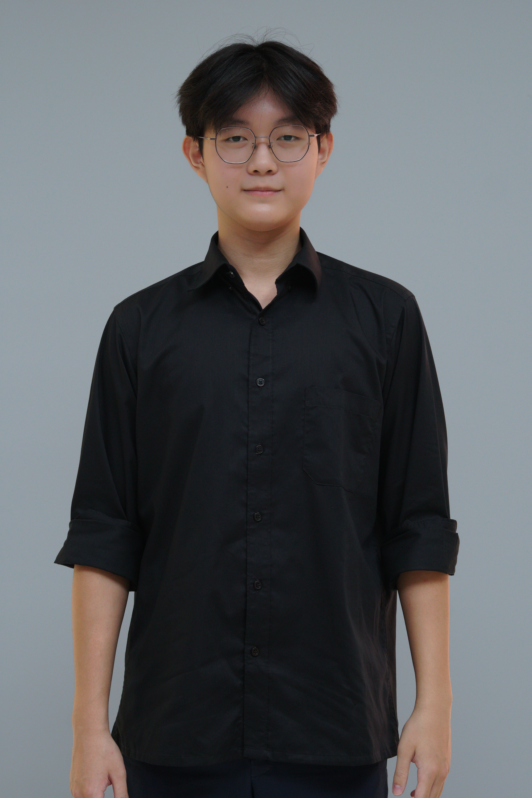
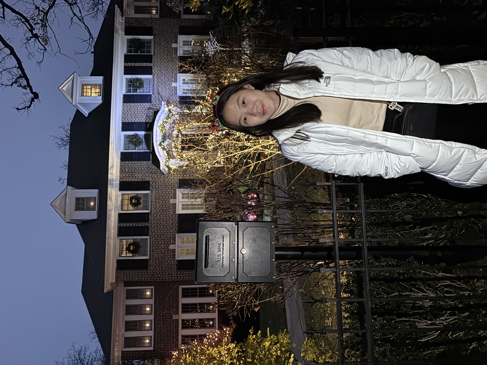
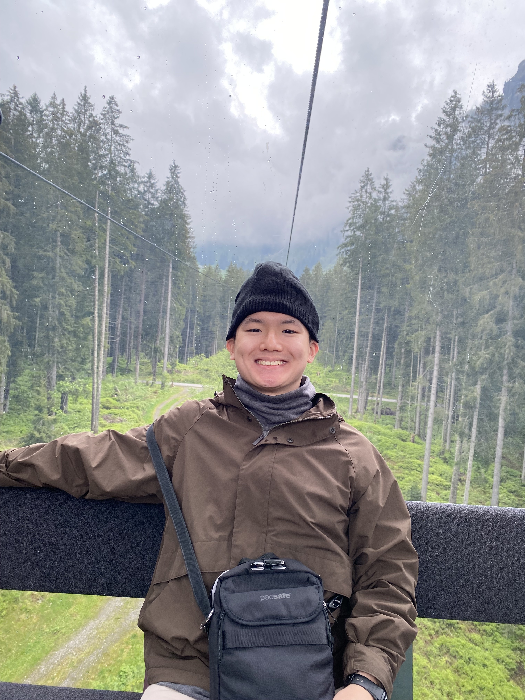

We are a team based in the [School of Computing, National University of Singapore](https://www.comp.nus.edu.sg).

You can reach us at the email `seer[at]comp.nus.edu.sg`

## Project team

### John Doe

[[homepage](http://www.comp.nus.edu.sg/~damithch)]
[[github](https://github.com/johndoe)]
[[portfolio](team/johndoe.md)]

* Role: Project Advisor

### Eron Dathan

[[github](https://github.com/rondth)]

* Role: Developer
* Responsibilities: Automatic Data Saving and Filter Member by Tag (filter) features

### Glory Charity Lion

[[github](http://github.com/glory-lion)] 

* Role: Developer
* Responsibilities: Editing the Data File and Bulk Tag Editing features

### Ian Abiel Wangsa

[[github](https://github.com/Manutd1234)]

* Role: Developer
* Responsibilities: List All Persons (`list`) and Clear All Entries (`clear`) features

### James Doe

[[github](http://github.com/johndoe)]
[[portfolio](team/johndoe.md)]

* Role: Developer
* Responsibilities: UI
