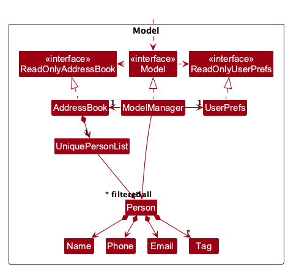
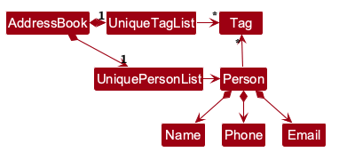
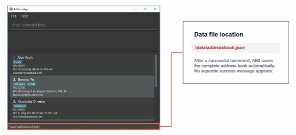
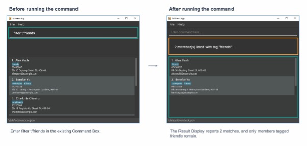

* Table of Contents
{:toc}

--------------------------------------------------------------------------------------------------------------------

## **Acknowledgements**

* _{List the sources of reused or adapted ideas, code, documentation, and third-party libraries here, with links to the originals.}_

--------------------------------------------------------------------------------------------------------------------

## **Setting up, getting started**

Refer to the guide [_Setting up and getting started_](SettingUp.md).

--------------------------------------------------------------------------------------------------------------------

## **Design**

<div markdown="span" class="alert alert-primary">

:bulb: **Tip:** The `.puml` files used to create diagrams are in `docs/diagrams`. Refer to the [_PlantUML Tutorial_ at se-edu/guides](https://se-education.org/guides/tutorials/plantUml.html) to learn how to create and edit diagrams.
</div>

### Architecture


The ***Architecture Diagram*** given above explains the high-level design of the App.

The following provides a quick overview of the main components and their interactions.

**Main components of the architecture**

**`Main`** (consisting of classes [`Main`](https://github.com/se-edu/addressbook-level3/tree/master/src/main/java/seedu/address/Main.java) and [`MainApp`](https://github.com/se-edu/addressbook-level3/tree/master/src/main/java/seedu/address/MainApp.java)) is in charge of the app launch and shut down.
* At app launch, it initializes the other components in the correct sequence, and connects them up with each other.
* At shut down, it shuts down the other components and invokes cleanup methods where necessary.

The bulk of the app's work is done by the following four components:

* [**`UI`**](#ui-component): The UI of the App.
* [**`Logic`**](#logic-component): The command executor.
* [**`Model`**](#model-component): Holds the data of the App in memory.
* [**`Storage`**](#storage-component): Reads data from, and writes data to, the hard disk.

[**`Commons`**](#common-classes) represents a collection of classes used by multiple other components.

**How the architecture components interact with each other**

The *Sequence Diagram* below shows how the components interact with each other for the scenario where the user issues the command `delete 1`.


Each of the four main components (also shown in the diagram above),

* defines its *API* in an `interface` with the same name as the Component.
* provides its functionality through a concrete `{Component Name}Manager` class that implements the corresponding API interface.

For example, the `Logic` component defines its API in `Logic.java` and implements it in `LogicManager.java`. Other components interact with a component through its interface rather than its concrete class, preventing them from coupling to that component's implementation, as illustrated in the following partial class diagram.


The sections below give more details of each component.

### UI component

The **API** of this component is specified in [`Ui.java`](https://github.com/se-edu/addressbook-level3/tree/master/src/main/java/seedu/address/ui/Ui.java)


The UI consists of a `MainWindow` and its parts, such as `CommandBox`, `ResultDisplay`, `PersonListPanel`, and `StatusBarFooter`. All of these, including `MainWindow`, inherit from the abstract `UiPart` class, which captures common behavior among classes that represent visible GUI parts.

The `UI` component uses the JavaFX UI framework. The layouts of these UI parts are defined in matching `.fxml` files in `src/main/resources/view`. For example, [`MainWindow.fxml`](https://github.com/se-edu/addressbook-level3/tree/master/src/main/resources/view/MainWindow.fxml) specifies the layout of [`MainWindow`](https://github.com/se-edu/addressbook-level3/tree/master/src/main/java/seedu/address/ui/MainWindow.java).

The `UI` component,

* executes user commands using the `Logic` component.
* listens for changes to `Model` data so that the UI can be updated with the modified data.
* keeps a reference to the `Logic` component, because the `UI` relies on the `Logic` to execute commands.
* depends on some classes in the `Model` component because it displays `Person` objects from the model.

### Logic component

**API** : [`Logic.java`](https://github.com/se-edu/addressbook-level3/tree/master/src/main/java/seedu/address/logic/Logic.java)

Here's a (partial) class diagram of the `Logic` component:


The sequence diagram below illustrates the interactions within the `Logic` component, taking `execute("delete 1")` API call as an example.


<div markdown="span" class="alert alert-info">:information_source: **Note:** The lifeline for `DeleteCommandParser` should end at the destroy marker (X), but due to a limitation of PlantUML, it continues to the end of the diagram.
</div>

How the `Logic` component works:

1. When `Logic` is called upon to execute a command, the command is passed to an `AddressBookParser` object, which in turn creates a parser that matches the command (e.g., `DeleteCommandParser`) and uses it to parse the command.
1. This results in a `Command` object (more precisely, an object of one of its subclasses e.g., `DeleteCommand`) which is executed by the `LogicManager`.
1. The command can communicate with the `Model` when it is executed (e.g. to delete a person).<br>
   Note that although this is shown as a single step in the diagram above for simplicity, the code can require several interactions between the command object and the `Model` to complete the operation.
1. The result of the command execution is encapsulated as a `CommandResult` object which is returned from `Logic`.

Here are the other classes in `Logic` (omitted from the class diagram above) that are used for parsing a user command:


How the parsing works:
* When called upon to parse a user command, the `AddressBookParser` class creates an `XYZCommandParser` (`XYZ` is a placeholder for the specific command name, e.g., `AddCommandParser`). The parser uses the other classes shown above to parse the user command and create an `XYZCommand` object (e.g., `AddCommand`). The `AddressBookParser` returns that object as a `Command` object.
* All `XYZCommandParser` classes, such as `AddCommandParser` and `DeleteCommandParser`, implement the `Parser` interface so they can be treated similarly where appropriate, for example during testing.

### Model component
**API** : [`Model.java`](https://github.com/se-edu/addressbook-level3/tree/master/src/main/java/seedu/address/model/Model.java)




The `Model` component,

* stores the address book data i.e., all `Person` objects (which are contained in a `UniquePersonList` object).
* stores the `Person` objects selected by the current filter, such as search results, in a separate _filtered_ list. It exposes this list as an unmodifiable `ObservableList<Person>` that the UI can observe and bind to, so the UI updates when the list changes.
* stores a `UserPrefs` object that represents the user’s preferences (currently, just the GUI settings). This is exposed to the outside as a `ReadOnlyUserPrefs` object.
* does not depend on any of the other three components (as the `Model` represents data entities of the domain, they should make sense on their own without depending on other components)

<div markdown="span" class="alert alert-info">:information_source: **Note:** The alternative, arguably more object-oriented, design below keeps a unique list of tags in `AddressBook`, and each `Person` references tags from that list. This lets `AddressBook` maintain one `Tag` object per unique tag instead of each `Person` holding its own `Tag` objects.<br>



</div>


### Storage component

**API** : [`Storage.java`](https://github.com/se-edu/addressbook-level3/tree/master/src/main/java/seedu/address/storage/Storage.java)


The `Storage` component,
* can save both address book data and user preference data in JSON format, and read them back into corresponding objects.
* is implemented by `StorageManager`, which delegates the actual JSON file access to `JsonAddressBookStorage` and `JsonUserPrefsStorage` (one class per data file).
* depends on some classes in the `Model` component (because the `Storage` component's job is to save/retrieve objects that belong to the `Model`)

### Common classes

Classes used by multiple components are in the `seedu.address.commons` package.

--------------------------------------------------------------------------------------------------------------------

## **Implementation**

This section describes some noteworthy details on how certain features are implemented.

### \[Proposed\] Undo/redo feature

#### Proposed Implementation

The proposed undo/redo mechanism is facilitated by `VersionedAddressBook`. It extends `AddressBook` with an undo/redo history, stored internally as an `addressBookStateList` and `currentStatePointer`. Additionally, it implements the following operations:

* `VersionedAddressBook#commit()` — Saves the current address book state in its history.
* `VersionedAddressBook#undo()` — Restores the previous address book state from its history.
* `VersionedAddressBook#redo()` — Restores a previously undone address book state from its history.

These operations are exposed in the `Model` interface as `Model#commitAddressBook()`, `Model#undoAddressBook()` and `Model#redoAddressBook()` respectively.

Given below is an example usage scenario and how the undo/redo mechanism behaves at each step.

Step 1. The user launches the application for the first time. The `VersionedAddressBook` will be initialized with the initial address book state, and the `currentStatePointer` pointing to that single address book state.


Step 2. The user executes `delete 5` command to delete the 5th person in the address book. The `delete` command calls `Model#commitAddressBook()`, causing the modified state of the address book after the `delete 5` command executes to be saved in the `addressBookStateList`, and the `currentStatePointer` is shifted to the newly inserted address book state.


Step 3. The user executes `add n/David …​` to add a new person. The `add` command also calls `Model#commitAddressBook()`, causing another modified address book state to be saved into the `addressBookStateList`.


<div markdown="span" class="alert alert-info">:information_source: **Note:** If a command fails its execution, it will not call `Model#commitAddressBook()`, so the address book state will not be saved into the `addressBookStateList`.

</div>

Step 4. The user now decides that adding the person was a mistake, and decides to undo that action by executing the `undo` command. The `undo` command will call `Model#undoAddressBook()`, which will shift the `currentStatePointer` once to the left, pointing it to the previous address book state, and restores the address book to that state.


<div markdown="span" class="alert alert-info">:information_source: **Note:** If the `currentStatePointer` is at index 0, pointing to the initial AddressBook state, then there are no previous AddressBook states to restore. The `undo` command uses `Model#canUndoAddressBook()` to check if this is the case. If so, it will return an error to the user rather
than attempting to perform the undo.

</div>

The following sequence diagram shows how an undo operation goes through the `Logic` component:


<div markdown="span" class="alert alert-info">:information_source: **Note:** The lifeline for `UndoCommand` should end at the destroy marker (X), but due to a limitation of PlantUML, it continues to the end of the diagram.

</div>

Similarly, how an undo operation goes through the `Model` component is shown below:


The `redo` command does the opposite — it calls `Model#redoAddressBook()`, which shifts the `currentStatePointer` once to the right, pointing to the previously undone state, and restores the address book to that state.

<div markdown="span" class="alert alert-info">:information_source: **Note:** If the `currentStatePointer` is at index `addressBookStateList.size() - 1`, pointing to the latest address book state, then there are no undone AddressBook states to restore. The `redo` command uses `Model#canRedoAddressBook()` to check if this is the case. If so, it will return an error to the user rather than attempting to perform the redo.

</div>

Step 5. The user then decides to execute the command `list`. Commands that do not modify the address book, such as `list`, will usually not call `Model#commitAddressBook()`, `Model#undoAddressBook()` or `Model#redoAddressBook()`. Thus, the `addressBookStateList` remains unchanged.


Step 6. The user executes `clear`, which calls `Model#commitAddressBook()`. Since the `currentStatePointer` is not pointing at the end of the `addressBookStateList`, all address book states after the `currentStatePointer` will be purged. Reason: It no longer makes sense to redo the `add n/David …​` command. This is the behavior that most modern desktop applications follow.


The following activity diagram summarizes what happens when a user executes a new command:


#### Design considerations:

**Aspect: How undo & redo execute:**

* **Alternative 1 (current choice):** Saves the entire address book.
  * Pros: Easy to implement.
  * Cons: May have performance issues in terms of memory usage.

* **Alternative 2:** Individual command knows how to undo/redo by
  itself.
  * Pros: Will use less memory (e.g. for `delete`, just save the person being deleted).
  * Cons: We must ensure that the implementation of each individual command is correct.

_{more aspects and alternatives to be added}_

### Automatic data saving

#### Current AB3 implementation

Automatic data saving is handled by `LogicManager#execute(String)`. After a command is parsed and executed
successfully, `LogicManager` passes the complete address book from `Model#getAddressBook()` to
`Storage#saveAddressBook(ReadOnlyAddressBook)`. As the complete address book is saved, members hidden from the
displayed list are included in the data file.

`StorageManager` delegates the save operation to `JsonAddressBookStorage`, which creates the data file and its
parent directories if needed before serialising the address book as JSON. The file is stored at
`data/addressbook.json`, relative to the application's working directory, and its path is displayed in the
status bar.

Saving is performed after every successfully executed command, including commands that do not change member
data. If parsing or command execution fails, saving is not attempted. A normal command result is returned only
after saving succeeds, so no separate save-success message is shown.

If saving fails, `LogicManager` converts the `IOException` into a `CommandException` for display to the user.
Any model change made before the failed save remains in memory, including a change made by `clear`.

At startup, an existing data file is loaded into the model. If the file is missing, sample data is loaded. If
the file cannot be read, TrackCall starts with an empty address book. Startup does not immediately save the
address book.

#### Proposed handling for planned commands

The [shared behaviour rules](#shared-behaviour-rules) below describe the intended saving policy,
including read-only commands and the special rollback required for `clear`. These differ from the
current starter implementation.

When `tagall` and `untagall` are implemented, each valid operation will trigger automatic saving, including a
valid operation that makes no changes. The proposed `filter` command will not save because it changes only the
displayed list. Read-only commands such as `help`, `list`, `find`, `filter`, and `exit` will also skip saving.



### \[Proposed\] Filter members by tag

#### Proposed Implementation

The `filter` command displays members with a specified tag without changing member data. Its format is:

`filter t/TAG`

Exactly one `t/TAG` parameter is accepted. The tag must contain 1 to 30 letters or numbers with no internal
spaces. Surrounding spaces are ignored, while matching is exact and case-sensitive.

`filter` narrows the currently displayed list, so it can be applied after `find` or another `filter`. It never
restores hidden members. Running `list` clears the active search and filters. Results keep their address-book
order, are renumbered from 1, and use the message `N member(s) listed with tag "TAG".` A zero-match result is
still successful, and later index-based commands use the displayed indices. No save is attempted.

An invalid command leaves the current list, active filter, and member data unchanged. Errors include a missing
or empty tag, invalid characters or spaces, a tag longer than 30 characters, multiple tags, and unknown
prefixes.



### \[Proposed\] Data archiving

_{Explain here how the data archiving feature will be implemented}_


--------------------------------------------------------------------------------------------------------------------

## **Documentation, logging, testing, dev-ops**

* [Documentation guide](Documentation.md)
* [Testing guide](Testing.md)
* [Logging guide](Logging.md)
* [DevOps guide](DevOps.md)

--------------------------------------------------------------------------------------------------------------------

## **Appendix: Requirements**

These requirements describe the intended TrackCall product. They are not a claim that every
feature works in v1.1, which still uses the AB3 starter behaviour.

The requirements are based on the team's [planning workbook][planning-workbook] (the **Narrative**
and **User Stories** tabs) and [MVP feature specification][feature-specification], reviewed on
27 September 2026. The narrative records a wider product vision. The feature specification
defines the selected MVP. Ideas outside that MVP are retained below rather than presented as
implemented features or promised releases.

[planning-workbook]: https://docs.google.com/spreadsheets/d/1yUrRwuZCovk-RjYpmL3fycJ850GcwzuLhNevJNQymYk/edit?gid=703584466
[feature-specification]: https://docs.google.com/document/d/1bjGzN0JqTA53ARoBUS9S9BcrwjB0BaFffD3k8ise17M/edit?tab=t.9anhuzxluv4w

### Product scope

**Target user profile**

* A club or small organisation's membership secretary who maintains its member roster.
* Works with names, phone numbers, email addresses, addresses, and overlapping groups such as
  committee, cohort, and alumni.
* Can type quickly and prefers short keyboard commands to repeated form filling or mouse actions.
* Regularly adds new members, corrects contact details, looks up members, and updates group tags.
* Starts by trying sample records and checking results, then learns frequently used commands.
* Uses the app on their own computer as a single operator. Shared accounts, concurrent editing,
  and routine shared-file access by several users are outside the product scope.
* Needs a small local roster. The performance target is 500 members; this is not a limit that
  rejects a 501st record.

**Value proposition**

TrackCall helps a membership secretary keep a club roster accurate and organise overlapping
groups using short typed commands. The secretary can find members, narrow the displayed group
by tag, and add or remove a tag for that whole group in one operation. This reduces repetitive
record-by-record work while keeping unrelated tags and hidden members unchanged. Records are
stored locally and valid changes are saved automatically, so the core workflow does not need
an internet connection or a separate save command.

**Selected MVP**

The MVP covers `help`, `add`, `list`, `edit`, `find`, `delete`, `clear`, `exit`, `filter`,
`tagall`, `untagall`, automatic saving, and manual editing of the local data file. Each member
has a name, phone number, email address, address, and zero or more tags.

The broader narrative must be read with these MVP decisions:

* Groups are tag assignments, not separate group objects. A label such as "Batch 2026" must be
  represented by a valid tag such as `Batch2026`; spaces are not allowed inside tags.
* Bulk selection means everyone in the displayed list after searching or filtering. There is
  no arbitrary multi-selection or direct edit/delete-by-name command. Individual edits and
  deletions use the current displayed index, which the secretary must check first.
* `find` matches complete name words. Substring and phone-number search are considered ideas,
  not current MVP search behaviour.
* Import/export, sorting, archiving, global tag renaming, bulk editing of non-tag fields, and
  an in-app handover/access feature are outside the selected MVP. Grade and class are not
  dedicated member fields; a cohort can be represented by a tag.
* Deletion is immediate and has no confirmation or undo. Archiving with retained history is
  different from deleting a record.
* TrackCall does not make calls, send messages, track payments, or renew memberships automatically.

### User stories

Priorities describe importance to the target user: `***` = essential, `**` = useful,
`*` = convenience. Priority is separate from implementation status. **MVP** means selected for
the intended core product, not already implemented in v1.1. **Considered** means recorded for
future decisions, with no delivery commitment.

The tables cover all 32 source stories. Overlapping stories are consolidated: spreadsheet rows
9 and 14 share US09; rows 22 and 23 share US17, with class-based sorting recorded in US33;
row 28 is covered by the reviewed group-removal workflow in US10. Row 24 is split between
complete-word lookup (US05) and substring lookup (US26). Existing story IDs are retained.

#### Stories selected for the MVP

| ID | Priority | As a... | I want to... | So that I can... |
| --- | --- | --- | --- | --- |
| US01 | `***` | new secretary | see a command summary and help for one command | check syntax without leaving the app |
| US02 | `***` | club secretary | add a member with contact details and optional tags | record a new club member |
| US03 | `***` | club secretary | list every member with their current displayed index | review the roster and select the right record |
| US04 | `***` | club secretary | edit a member's contact details | correct mistakes and keep the roster up to date |
| US05 | `***` | club secretary | find members using complete words from their names | retrieve a member's contact details quickly |
| US06 | `***` | club secretary | delete one selected member record | remove a record that is no longer needed |
| US07 | `***` | club secretary | clear the whole roster | reset the directory when all existing records are no longer needed |
| US08 | `***` | club secretary | filter the displayed members by an exact tag | work with one group or an overlap of groups |
| US09 | `***` | club secretary | add one tag to all displayed members without removing other tags | assign a group without editing each member separately |
| US10 | `***` | club secretary | review a group and remove one tag from every displayed member | remove an obsolete group assignment while keeping member records and other tags |
| US11 | `***` | club secretary | have valid changes saved automatically | recover my saved roster when I next open the app |
| US12 | `***` | club secretary | receive clear input and storage error messages | correct the problem and know whether my changes were saved |
| US13 | `***` | club secretary | close the app with a command | finish my work using the keyboard |
| US14 | `***` | experienced secretary | edit a backed-up data file while the app is closed | make awkward data corrections outside the app when necessary |
| US18 | `***` | prospective club secretary | try TrackCall with sample member data | understand the workflow without risking real records |
| US20 | `***` | first-time user | read valid command examples and their expected results in help | learn to use commands independently |
| US23 | `***` | club secretary | assign a valid group tag to a member | represent groups such as Committee or Batch2026 |
| US24 | `***` | club secretary | add a tag to one member while retaining their other tags | let that member belong to several groups |
| US25 | `***` | club secretary | view a member's complete contact details and tags | check the correct record before using its details |
| US28 | `***` | club secretary | remove one member's tag while retaining their other tags | update their group membership without losing unrelated information |
| US35 | `***` | club secretary | have exact duplicate records rejected during data entry | avoid recording the same contact details twice |

US24 and US28 do not introduce new commands. For an individual `edit`, the secretary supplies
the complete tag set that should remain. The bulk commands preserve unrelated tags and can
also be used when the checked displayed list contains exactly one intended member.

#### Considered stories outside the selected MVP

| ID | Priority | As a... | I want to... | So that I can... | Scope decision |
| --- | --- | --- | --- | --- | --- |
| US15 | `**` | club secretary | export member records | share a copy for verification or submission | Considered; no export command in the MVP. |
| US16 | `**` | club secretary | hide private contact details on screen | reduce accidental disclosure to people nearby | Retained from the earlier DG; no privacy-display mode in the MVP. |
| US17 | `*` | club secretary | sort members by name | browse a long roster more easily | Considered; the MVP preserves roster order. |
| US19 | `**` | first-time user | follow a short in-app getting-started guide | learn the basic workflow step by step | Considered; the MVP provides command help, not an onboarding wizard. |
| US21 | `**` | club secretary | import an existing membership spreadsheet | avoid entering every member manually | Considered; loading a valid JSON data file is not spreadsheet import. |
| US22 | `**` | club secretary | review imported member records | confirm that an import completed correctly | Considered with US21. |
| US26 | `**` | club secretary | search using part of a name word | find someone when I cannot remember the complete word | Considered; the MVP uses complete-word matching. |
| US27 | `**` | club secretary | search by phone number | identify a member when I only have their number | Considered; the MVP searches names only. |
| US29 | `**` | club secretary | rename a group tag across its members | correct a group name without rebuilding its membership | Considered; no atomic global rename operation in the MVP. |
| US30 | `**` | club secretary | update a non-tag field for a group in one operation | handle repeated renewal changes efficiently | Considered; bulk changes in the MVP affect tags only. |
| US31 | `**` | long-time secretary | archive an inactive member | reduce clutter while keeping their history | Considered; deletion in the MVP does not retain history. |
| US32 | `*` | long-time secretary | archive an unused group tag | keep old groups out of my active work without losing their history | Considered; no tag archive or separate tag catalogue in the MVP. |
| US33 | `*` | club secretary | sort members by class | review members in the order relevant to my task | Considered; the MVP has neither a class field nor sorting. |
| US34 | `**` | club secretary | cancel a deletion before confirming it | avoid losing a record after selecting the wrong member | Not selected; MVP deletion and clearing are immediate, without confirmation or undo. |
| US36 | `**` | outgoing secretary | hand over my roster and command guidance to my successor | let the next secretary continue club administration | No in-app access-transfer feature. Shared accounts and routine multi-user data access are excluded by the course's single-user constraint. |

### Shared behaviour rules

These rules describe the selected MVP and apply to the use cases below.

1. Command keywords and prefixes are lowercase. Trim surrounding spaces and tabs from values.
   Reject invalid input before changing records, the displayed list, filters, or the saved file.
   The fields below use the same validation in `add`, `edit`, and manual data loading.
2. Two records are duplicates only when their trimmed name, phone, email, and address all match
   exactly, including case and internal spacing. Tags do not affect identity. Different people
   may share a name when another contact field differs. An edit excludes its own record from
   this check. Duplicate checking does not establish a person's real-world identity.
3. A tag contains 1 to 30 ASCII letters or digits and is case-sensitive. It contains no internal
   whitespace. Store each tag once per member and display tags in ASCII order: digits,
   uppercase letters, then lowercase letters.
4. `list` resets all searches and tag filters. `find KEYWORD [MORE_KEYWORDS]` searches the full
   roster and replaces the previous search and filters. It matches complete name words,
   ignores letter case, and accepts a match on any keyword. Repeated keywords do not repeat records.
5. `filter t/TAG` narrows the currently displayed list using exact, case-sensitive tag matching.
   Repeated filters retain the intersection of the tags and the active name search. A valid
   zero-match result is successful. Use `list` first to filter the whole roster.
6. An index is an ASCII-digit integer from 1 through the current displayed count. Leading zeroes
   are accepted; signs, decimals, and internal whitespace are not. It refers to the list when
   the command is submitted. Commands preserve roster order and renumber the displayed records.
7. `edit INDEX ...` changes only supplied fields. At least one field must be supplied.
   Supplied tags replace the full existing tag set. A lone `t/` clears all tags and cannot be
   combined with a non-empty tag. Reapply the active search and filters after an edit; an edited
   member can disappear from the view while remaining stored.
8. `tagall t/TAG` and `untagall t/TAG` accept exactly one tag and fix their target set to everyone
   displayed when the command is submitted. Hidden members and unrelated tags are unchanged.
   Adding an existing tag or removing an absent tag skips that member. Reapply searches and
   filters after the whole batch. Changed and skipped counts refer to the original target set.
9. Valid `add`, `edit`, `delete`, `clear`, `tagall`, and `untagall` commands save the complete
   roster, including valid operations that make no change. An empty bulk target is an error
   and does not save. `help`, `list`, `find`, `filter`, and `exit` do not save.
10. Report data-changing command success only after saving succeeds. A failed save preserves
    the previous saved file and reports a storage error. Except for `clear`, changes remain in
    memory and can be lost on exit. Failed `clear` restores the previous records, displayed
    list, and filters. To retry saving, resolve the storage problem and run a valid data-changing
    command; a valid no-op can be used without making another data change.
11. `add` restores the full list and appends the record. `delete` removes one indexed record and
    retains the active search and filters. `clear` removes all records, including hidden ones,
    resets the view, and preserves application settings. Deletion and clearing have no
    confirmation or undo. `list`, `clear`, and `exit` reject extra arguments. `exit` closes the
    app without a final save or another warning about unsaved changes.
12. Startup reads the local `data/addressbook.json` relative to the working directory. A missing
    file loads sample members and reports that fact. An invalid or unreadable file loads zero
    members and reports the error. Startup and read-only commands leave the file untouched.
    A valid empty roster stays empty. A later successful data-changing command can replace an
    invalid file, so restore or repair it before making changes if its contents are needed.

#### Member field rules

`add` requires `n/NAME p/PHONE_NUMBER e/EMAIL a/ADDRESS` and accepts optional repeated `t/TAG`
parameters. Fields may appear in any order. `edit` uses the same field rules for supplied values.
Reject unknown prefixes and repeated `n/`, `p/`, `e/`, or `a/` prefixes. Check command structure,
then values in name/phone/email/address/tag order, then duplicate identity.

| Field | Requirement |
| --- | --- |
| Name | ASCII letters, digits, and spaces, with at least one letter or digit. Preserve internal spaces and case. |
| Phone | At least three ASCII digits, without signs, punctuation, or internal whitespace. This does not verify reachability. |
| Email | Exactly one `@` and no whitespace. The local part allows ASCII letters, digits, and the punctuation listed below. Domain labels are separated by dots; each starts and ends with a letter or digit, with hyphens allowed internally. Syntax validation does not verify mailbox existence. |
| Address | Non-empty single-line text after trimming surrounding spaces or tabs. Preserve internal spaces, tabs, and case. |
| Tags | Rule 3 applies. A member can have zero or more tags. Repeated identical tags collapse into one assignment. An empty tag is invalid except for the lone `t/` edit operation in rule 7. |

Allowed email local-part punctuation:

```text
! # $ % & ' * + / = ? ^ _ ` { | } ~ . -
```

### Use cases

**System:** TrackCall. **Primary actor:** the membership secretary.
**MSS:** main success scenario. The app is open unless a use case states otherwise.
These are representative user workflows for the planned product, not implementation instructions.

#### UC01: Register a member

**Related stories:** US02, US23, US35. **Goal:** add a new member and retain the record for later sessions.

**MSS**

1. The secretary submits the member's required contact details and optional tags.
2. TrackCall validates the details and checks for an exact duplicate record.
3. TrackCall adds the member, saves the roster, and restores the complete member list.
4. TrackCall reports the added member's details. The use case ends.

**Extensions**

* **2a.** The command structure or a field is invalid, or the member duplicates an existing record.
  TrackCall explains the error and changes nothing. The secretary can correct the input at step 1.
* **3a.** Saving fails. TrackCall reports the storage error instead of success. The new member remains
  in memory, but the saved file is unchanged. The use case ends without confirmed persistence;
  recovery follows shared rule 10.

#### UC02: Find and update a member

**Related stories:** US03, US04, US05, US24, US25, US28. **Goal:** correct one member's record.

**MSS**

1. The secretary searches for complete words from the member's name.
2. TrackCall lists matching records and their current indices.
3. The secretary checks the contact details to identify the intended member, then submits its
   displayed index and the fields to change.
4. TrackCall validates the edit, updates the record, saves the roster, and reapplies the search and filters.
5. TrackCall reports the edited details. The use case ends.

**Extensions**

* **1a.** The search has no keyword. TrackCall reports the input error and preserves the view.
  The secretary can retry step 1.
* **2a.** No record matches. TrackCall shows an empty result. The secretary can search again at step 1
  or end the use case without changing data.
* **4a.** The index or fields are invalid, no field is supplied, or the edit duplicates another record.
  TrackCall reports the error without changing records or the view. The secretary can retry step 3.
* **4b.** Saving fails. The edit remains in memory, the saved file is unchanged, and TrackCall reports
  the storage error. The use case ends without confirmed persistence; recovery follows rule 10.

An edited member that no longer matches the search or filters disappears from the displayed list
but remains in the roster. The secretary can use `list` to see it again.

#### UC03: Update a group's tags

**Related stories:** US08, US09, US10. **Goal:** change one group assignment without changing unrelated tags.

**MSS**

1. The secretary requests the complete roster.
2. TrackCall lists all members.
3. The secretary searches or filters to identify the intended group.
4. TrackCall displays the matching members.
5. The secretary checks the affected group and requests adding or removing one tag from it.
6. TrackCall validates the request, fixes the target set, updates its tags, and saves the roster.
7. TrackCall reapplies the search and filters and reports changed and skipped counts. The use case ends.

**Example:** enter `list`, `filter t/year1`, and `tagall t/committee` as separate commands.
This adds `committee` to the displayed year-one members and retains their other tags.

**Extensions**

* **3a.** A search or filter request is invalid. TrackCall reports the error and preserves the prior
  view. The secretary can correct the request at step 3.
* **4a.** No members match. The secretary can restart at step 1 or end the use case. A bulk update
  on an empty list is rejected without changing or saving data.
* **6a.** The tag is empty or invalid, or more than one tag or an unknown prefix is supplied.
  TrackCall reports the error and changes nothing. The secretary can retry step 5.
* **6b.** Some targets already have the added tag or lack the removed tag. TrackCall skips those
  assignments, saves the roster, and continues to step 7. A non-empty target with no changes is
  still a valid operation; it does not create duplicate tags.
* **6c.** Saving fails. The complete batch remains in memory, the saved file is unchanged, and
  TrackCall reports the storage error. The use case ends without confirmed persistence;
  recovery follows rule 10.

Removing a tag required by an active filter can hide the affected members after step 7. It does
not delete them. Counts still refer to the target set fixed at step 6.

#### UC04: Remove one member

**Related stories:** US05, US06, US25. **Goal:** remove one unwanted record while retaining other members.

**MSS**

1. The secretary lists, searches, or filters the roster.
2. TrackCall displays the resulting records and their current indices.
3. The secretary checks the intended member's details and requests deletion using its displayed index.
4. TrackCall validates the request, removes that record, saves the roster, and renumbers the
   remaining displayed records while retaining the active search and filters.
5. TrackCall reports the deleted record. The use case ends.

**Extensions**

* **1a.** The listing, search, or filter command is invalid. TrackCall reports the error and preserves
  the current view. The secretary can retry step 1.
* **2a.** The result is empty. No member can be selected. The use case ends without changes.
* **4a.** The deletion command or index is invalid. TrackCall reports the error and removes nothing.
  The secretary checks the current list and retries step 3.
* **4b.** Saving fails. The record remains deleted in memory but may return after restart. TrackCall
  reports the storage error and leaves the saved file unchanged. The use case ends without
  confirmed persistence; recovery follows rule 10.

Deletion has no confirmation or undo. It removes the underlying record, not just its visible card.

#### UC05: Reset the whole roster

**Related story:** US07. **Goal:** remove all member records, including records outside the current view.

**MSS**

1. The secretary decides to remove all records and requests clearing the roster.
2. TrackCall validates the request, removes every member, and resets the search and filters.
3. TrackCall saves the empty roster and reports the number removed. The use case ends.

**Extensions**

* **2a.** The command contains extra arguments. TrackCall rejects it without changing anything.
  The secretary can retry step 1.
* **2b.** The roster is already empty. TrackCall still attempts to save it and reports that no changes
  were needed only if saving succeeds. The use case ends. If saving fails, extension 3a applies.
* **3a.** Saving fails. TrackCall restores the previous records, displayed list, and filters and
  leaves the saved file unchanged. It reports that no members were removed. The secretary can
  resolve the storage problem and retry step 1.

There is no confirmation or undo. Recovery after a successful clear requires a pre-existing backup.

#### UC06: Look up a command

**Related stories:** US01, US20. **Goal:** learn how to perform a task without leaving the app.

**MSS**

1. The secretary requests the command summary with `help`.
2. TrackCall displays the available command syntax.
3. The secretary requests one command's details, for example `help tagall`.
4. TrackCall displays that command's purpose, syntax, examples with expected results, parameter
   rules, and errors. The use case ends.

**Extensions**

* **1a.** The request uses an unknown command keyword, such as `-help`, `-h`, or `HELP`.
  TrackCall reports `Unknown command. Type help for available commands.` The secretary can retry step 1.
* **3a.** The topic is unknown or uses the wrong case. TrackCall reports that there is no help entry
  for that topic and suggests `help` to list commands. The secretary can retry step 3.
* **3b.** More than one topic is supplied. TrackCall reports that only one command can be inspected
  at a time and shows `help [COMMAND]` as the usage. The secretary can retry step 3.

The secretary may start at step 3 when the command is already known. Topic keywords are lowercase.
Surrounding whitespace is ignored and repeated separator whitespace is accepted. All help requests
leave member data and the displayed member list unchanged and do not save the data file.

#### UC07: Load a manually edited data file

**Related stories:** US11, US12, US14. **Goal:** load valid corrections made outside the app.
**Preconditions:** TrackCall is closed and the secretary has backed up the data file.

**MSS**

1. The secretary edits and saves the JSON data file while preserving its structure and valid member fields.
2. The secretary starts TrackCall.
3. TrackCall validates the complete file and loads its members in file order.
4. TrackCall displays the loaded roster. The secretary checks the corrections. The use case ends.

**Extensions**

* **3a.** The file is missing. TrackCall loads sample members and reports the missing file. It creates
  the file only after a valid data-changing command saves successfully. The use case ends.
* **3b.** The file has invalid JSON, structure, fields, or duplicate records. TrackCall loads zero
  members, reports the problem, and preserves the file. No partial import occurs. The secretary
  closes the app and repairs or restores the file, then retries step 2.
* **3c.** The file cannot be read. TrackCall loads zero members, reports the operating-system error,
  and leaves the file untouched. The secretary closes the app, fixes access, and retries step 2.

The file uses UTF-8 JSON with a `persons` array. Each member has exactly `name`, `phone`, `email`,
and `address` string fields and a `tagged` array of strings. Missing, null, wrongly typed, unknown,
or repeated fields, comments, and trailing commas invalidate the file. Member values follow the
shared field rules, including rule 3 for tags. Repeated identical tags collapse into one assignment;
duplicate members invalidate the whole file. `{"persons": []}` is a valid empty roster.

Do not edit the data file while TrackCall is running. A later successful data-changing command can
overwrite an invalid file; restore or repair it first if the original contents are needed.

### Non-Functional Requirements

These are acceptance requirements for the intended product, not results already measured on v1.1.
They include relevant [course product constraints][course-constraints]. The performance workload
is a test target, not a restriction on accepted records.

[course-constraints]: https://nus-cs2103-ay2627-s1.github.io/website/admin/tp-constraints.html

| ID | Quality or constraint | Acceptance requirement |
| --- | --- | --- |
| NFR01 | Platform compatibility | The released application runs on Windows, macOS, and Linux with Java 25, without needing a second Java version. |
| NFR02 | Portable distribution | The release is a single JAR no larger than 100 MB. Running it requires no installer or separately installed application dependencies beyond the compatible Java runtime. |
| NFR03 | Offline availability | Core roster management and in-app help remain usable with networking disabled. They do not depend on a team-operated server. |
| NFR04 | Keyboard usability | After launch, every in-app MVP operation can be completed using typed commands and keyboard navigation, without a required mouse action. Manual file editing uses an external text editor. |
| NFR05 | Display usability | At 1920 x 1080 or higher with 100% or 125% scaling, controls and text remain readable without layout overlap. At 1280 x 720 or higher with 150% scaling, every function remains usable. Long rosters and help text remain accessible by scrolling. |
| NFR06 | Local data privacy | Core operations do not transmit member records to external services. The MVP provides no login or encryption; protection of the local file relies on the user's operating-system access controls. |
| NFR07 | Inspectable storage | Member data is stored locally as human-editable UTF-8 JSON, with no DBMS required. The saved data can be read and corrected using an ordinary text editor while the app is closed. |
| NFR08 | Response time | With 500 members and a data file of at most 1 MB, each normal in-app command completes within 2 seconds on a computer with a 2 GHz dual-core CPU, 4 GB RAM, local SSD, and no competing heavy workload. Measure from submission to displayed result, including any save; exclude startup and shutdown. Record the OS, Java version, hardware, dataset, and timings when testing. |
| NFR09 | Persistence reliability | After a data-changing command reports success, a normal restart retains the saved roster. A simulated write failure leaves the previous saved file intact and is never reported as success. In-memory recovery follows rule 10, including the rollback required for `clear`. |

Input validation, duplicate rejection, filtering, and no-op behaviour are functional requirements
and are recorded in the shared rules instead of being counted as NFRs. Development-process rules,
such as incremental delivery, are also not product NFRs.

### Glossary

| Term | Meaning |
| --- | --- |
| Membership secretary | The single operator responsible for keeping a club or organisation's member roster up to date. |
| Roster / address book | The complete collection of member records, including records hidden from the displayed list. The file and starter code use the term address book. |
| Member record | One member's name, phone number, email address, address, and tag assignments. |
| Group | A set of members sharing a tag, such as a committee or cohort. Groups are not separate stored objects in the MVP. |
| Tag | A case-sensitive label containing 1 to 30 ASCII letters or digits, assigned at most once to each member. |
| Displayed list | The records currently visible after the active search and tag filters. It is the target set for a bulk tag command. |
| Active search and filters | The current name-search condition and cumulative tag conditions used to determine which records are displayed. A new `find` replaces them; `list` clears them. |
| Index | A record's current displayed number, starting at 1. It is not a permanent member ID and can change after another command. |
| Complete-word matching | Matching a whole word in a name. For example, `John` matches `John Tan`, but `Jo` does not. |
| Bulk tag update | Adding or removing one tag for the fixed set of members displayed when the command is submitted. |
| Duplicate record | A record whose trimmed name, phone, email, and address all exactly match another record, including case and internal spacing. Tags are ignored. |
| No-op | A valid operation that leaves record values unchanged. A valid data-changing no-op can still retry saving; a bulk command with no targets is an error. |
| In-memory data | The working roster held by the running app. After a save failure it can differ from the file and may be lost on exit. |
| Persisted data | The roster successfully written to the local data file and available for a later session. |
| Data-changing command | `add`, `edit`, `delete`, `clear`, `tagall`, or `untagall`. A valid invocation attempts to save even if its values do not change. |
| Read-only command | A command that does not change member records or save the data file, such as `help`, `list`, `find`, or `filter`. It may change the displayed list. |
| JSON | The structured text format of the local data file. TrackCall's schema uses a `persons` array and each member's `tagged` array. |
| Archive | Retain an inactive record or tag and its history separately from active work. This considered feature is different from MVP deletion. |
| MVP | Minimum viable product: the selected core feature set in the team specification. It does not mean that all those features exist in v1.1. |


--------------------------------------------------------------------------------------------------------------------

## **Appendix: Instructions for manual testing**

Given below are instructions to test the app manually.

<div markdown="span" class="alert alert-info">:information_source: **Note:** These instructions only provide a starting point for testers to work on;
testers are expected to do more *exploratory* testing.

</div>

### Launch and shutdown

1. Initial launch

   1. Download the JAR file and copy it into an empty folder.

   1. Double-click the JAR file.<br>
      Expected: The GUI opens with a set of sample contacts. The window size may not be optimal.

1. Saving window preferences

   1. Resize the window to an optimal size. Move the window to a different location. Close the window.

   1. Relaunch the app by double-clicking the JAR file.<br>
       Expected: The most recent window size and location are retained.

1. _{ more test cases …​ }_

### Deleting a person

1. Deleting a person while all persons are being shown

   1. Prerequisites: List all persons using the `list` command, with multiple persons in the list.

   1. Test case: `delete 1`<br>
      Expected: The first contact is deleted from the list. The status message shows the deleted contact's details.

   1. Test case: `delete 0`<br>
      Expected: No person is deleted. The status message shows error details.

   1. Other incorrect delete commands to try: `delete`, `delete x`, `...` (where x is larger than the list size)<br>
      Expected: Similar to previous.

1. _{ more test cases …​ }_

### Saving data

1. Dealing with missing/corrupted data files

   1. _{Explain how to simulate missing or corrupted data files and state the expected behavior.}_

1. _{ more test cases …​ }_
