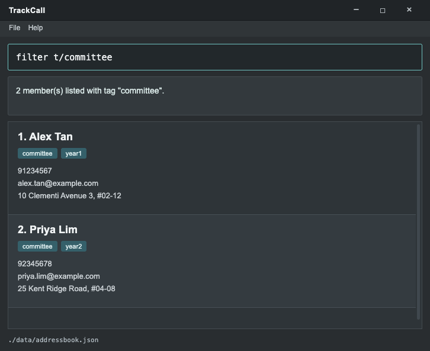

TrackCall is being developed for membership secretaries who maintain their organisation's member contact records. The planned product provides a keyboard-based workflow for keeping a roster of up to 500 members accurate and easy to share as members renew, change roles, or move between groups.

## Current development version

The project currently contains the AddressBook Level 3 (AB3) starter application. The screenshot and guides describe this starting point; TrackCall-specific features are under development.

* To try the application, follow the [Quick Start section of the User Guide](UserGuide.html#quick-start).
* To work on the codebase, see the [Developer Guide](DeveloperGuide.html) and [setup instructions](SettingUp.html).

## Acknowledgements

* Based on [AddressBook Level 3](https://se-education.org/addressbook-level3) from the [SE-EDU initiative](https://se-education.org).
* Libraries used: [JavaFX](https://openjfx.io/), [Jackson](https://github.com/FasterXML/jackson), [JUnit5](https://github.com/junit-team/junit5).
